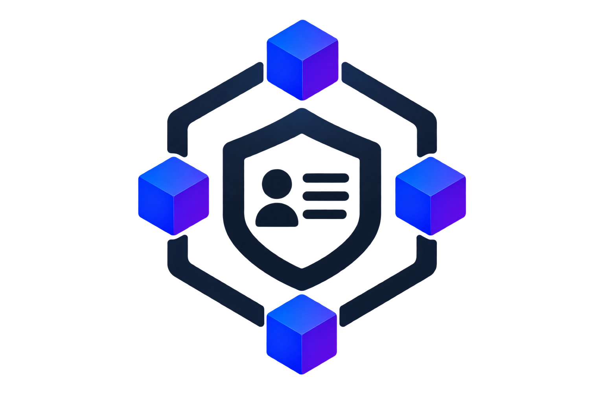
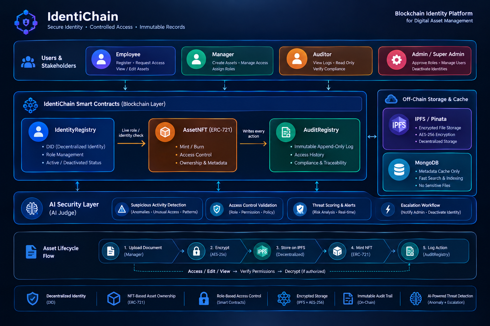
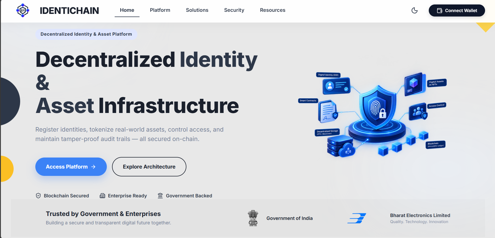

<h1 align="center">
  <br>
  IdentiChain
</h1>

<p align="center">
  <b>Blockchain-Based Secure Platform for Identity, Access Control, and Digital Asset Management</b><br>
  Secure Identity · Controlled Access · Encrypted Assets · Immutable Audit · AI-Assisted Threat Detection
</p>

IdentiChain is a blockchain-based security platform designed to combine decentralized identity, role-based access control, encrypted digital asset management, NFT-based ownership, immutable audit trails, and AI-assisted threat detection in one workflow.

The platform is designed around a simple principle:
> **Identity → Authorization → Protected Asset → Verifiable Activity → Threat Detection → Controlled Response**

---

## ✨ Overview

Organizations handle sensitive identities, documents, and digital assets that require controlled access and reliable accountability.

IdentiChain addresses this by combining:
*   **🔐 Decentralized Identity:** Using wallet-based identity and DID-oriented identity records
*   **👥 Role-Based Access Control:** For Employee, Manager, Auditor, and Admin roles
*   **⛓️ Smart-Contract Enforcement:** For identity, permissions, ownership, and audit events
*   **🗂️ Encrypted IPFS Storage:** For protected digital assets
*   **🪙 NFT-Based Asset Representation:** For ownership and asset state
*   **🧾 Immutable Audit Trail:** For security and compliance
*   **🤖 AI Judge / Threat Detection:** For suspicious activity and anomaly analysis
*   **🚨 Escalation Workflow:** From Auditor → Manager → Admin
*   **🛑 Identity Deactivation:** As the final enforcement action for confirmed security incidents
*   **🕐 Version History:** For controlled document modifications
*   **🔎 Auditor Filtering:** By time, role, and wallet/activity

---

## 🏗️ Architecture


The complete platform can be viewed as five connected layers:

### Core Smart Contracts

| Contract | Responsibility |
| :--- | :--- |
| **IdentityRegistry** | Identity records, roles, active/deactivated status |
| **AssetNFT** | Asset representation, ownership, access control and metadata |
| **AuditRegistry** | Immutable append-only security and activity events |

---

## 🔄 End-to-End Workflow

### 1. Identity Registration
An employee connects their wallet and creates an organizational profile with: Name, Email, Department, Designation, and Requested role. A new user does not automatically receive privileged permissions.

### 2. Admin Role Approval
The administrator reviews the role application and approves the requested organizational role. The role is associated with the employee's wallet and used by the platform for authorization.

### 3. Secure Asset Creation
A manager can create a protected digital asset. The asset lifecycle is:
`Document → Cryptographic Hash → Encryption → Encrypted File → IPFS / Pinata → NFT / Asset Record → Immutable Audit Event`

The plaintext document is not simply exposed as a public IPFS object. The protected/encrypted representation is stored, while blockchain records maintain verifiable asset state and ownership information.

### 4. Permissioned Access
Managers can grant access to a specific employee wallet. Permissions can include: View, Edit, and Usage/view limits. Access is validated against the configured permissions rather than relying only on frontend restrictions.

### 5. Controlled Document Editing
An authorized employee can access the asset according to the permission granted to their wallet. When the employee modifies a document:
`Employee Edit → Submit for Review → Manager Review → (Approve/Reject) → New Approved Version`

### 6. Version History
Approved modifications create a traceable asset history providing controlled modification and historical traceability.

---

## 🤖 AI-Assisted Threat Detection

IdentiChain includes an AI-assisted security layer that analyzes access behavior for suspicious patterns. For the demonstrated threat scenario, an employee repeatedly requests access to an asset within a short period.

`Repeated Access Attempts → Behavioral Analysis → Suspicious Pattern → AI Alert`

The threat alert can include: Employee wallet, Suspicious activity, Anomaly/threat classification, AI analysis, and Related security information.

## 🚨 Security Escalation Workflow

A detected threat follows a controlled escalation path:
`AI Threat Detection → Auditor (Forward) → Manager (Escalate) → Admin (Deactivate Identity) → Blockchain Record`

Once the administrator deactivates the identity, the affected employee can no longer access the protected organizational dashboard or assets.

## 🧾 Immutable Audit Trail

Important platform actions are recorded as auditable events, including role activity, asset creation, permissions, edits, security events, and identity deactivation. Auditors can investigate activity using filters such as time period, role, and wallet address.

---

## 🔐 Security Model

IdentiChain separates sensitive file storage from blockchain state.

*   **On-chain:** Identity state, Role assignment, Active/deactivated status, Asset ownership, Access permissions, NFT/asset state, Audit events, Security enforcement actions.
*   **Off-chain:** Encrypted file storage, IPFS content, Metadata/search, AI-assisted analysis.

This approach avoids putting sensitive document contents directly on the public blockchain while still maintaining verifiable ownership, permissions, and activity records.

---

## 🧩 Technology Stack

| Layer | Technology |
| :--- | :--- |
| **Frontend** | React + Vite |
| **Backend** | Node.js + Express |
| **Blockchain** | Ethereum / Solidity |
| **Smart Contracts** | IdentityRegistry, AssetNFT, AuditRegistry |
| **Asset Standard** | ERC-721 |
| **Decentralized Storage** | IPFS / Pinata |
| **Database** | MongoDB |
| **Identity** | Wallet-based / DID-oriented identity |
| **Security** | Encryption + Cryptographic Hashing |
| **Threat Detection** | AI Judge / Anomaly Detection |
| **Access Control** | Smart-contract-enforced permissions |

---

## 👤 Platform Roles

*   **Employee:** Register identity, Request organizational role, View permitted assets, Edit assets when authorized, Submit modifications for review.
*   **Manager:** Create digital assets, Mint asset representations, Grant/restrict access, Configure usage limits, Review employee modifications, Approve new asset versions, Review and escalate security alerts.
*   **Auditor:** Monitor immutable activity, Investigate asset and identity events, Filter logs, Review AI threat alerts, Dismiss false alerts or forward incidents.
*   **Admin / Super Admin:** Approve roles, Manage organizational identities, Review escalated security events, Deactivate compromised/suspicious identities.

---

## 🎯 Problem → Solution Mapping

| Problem | IdentiChain Approach |
| :--- | :--- |
| Centralized identity dependency | Wallet-linked decentralized identity |
| Unauthorized access | Smart-contract-controlled permissions |
| Uncontrolled document sharing | Wallet-specific access rights |
| Unlimited asset usage | View/usage limits |
| Sensitive file exposure | Encryption before decentralized storage |
| Difficult ownership tracking | NFT-based asset representation |
| Silent document modification | Review and approval workflow |
| Loss of historical versions | Version history |
| Tampering with activity records | Immutable audit registry |
| Suspicious access behavior | AI-assisted threat detection |
| Slow incident escalation | Auditor → Manager → Admin workflow |
| Persistent unauthorized access | On-chain identity deactivation |

---

## 📁 Repository Structure

```text
IdentiChain/
│
├── client/          # Frontend (React + Vite)
├── server/          # Backend (Node.js + Express)
├── contract/        # Smart Contracts (Solidity + Hardhat)
├── docs/            # Architecture diagrams & documentation
└── README.md
```

### 📸 Dashboard Preview


---

## 🔭 Future Scope
*   More sophisticated behavioral threat models
*   Additional enterprise identity integrations
*   Fine-grained permission policies
*   Hardware-backed wallet authentication
*   Advanced compliance reporting
*   Cross-chain asset/identity interoperability
*   More automated security-response policies

## 👥 Team
**Team CodeTitan**
Built for Smart India Hackathon (SIH) under the problem statement: *Blockchain-Based Secure Platform for Identity, Access Control, and Digital Asset Management*

